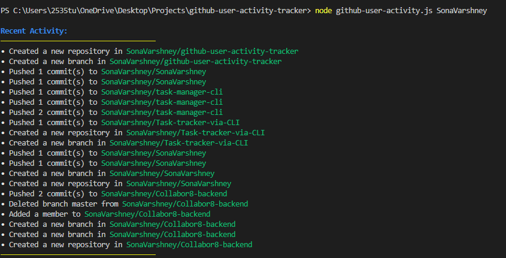

````markdown
# GitHub User Activity Tracker

## Overview

The GitHub User Activity Tracker is a Node.js CLI application that fetches and displays the recent activity of a specified GitHub user. It uses the GitHub API to retrieve user events and formats the output using the [`chalk`](https://www.npmjs.com/package/chalk) library for enhanced readability.

## Features

- Fetches recent activity of a specified GitHub user.
- Displays various types of events such as commits, pull requests, issues, and more.
- Uses [`chalk`](https://www.npmjs.com/package/chalk) to color-code the output for better readability.
- Handles errors such as user not found or request failures.

## Prerequisites

- Node.js (version 12 or higher)
- npm (Node Package Manager)

## Installation

1. **Clone the repository**:
   ```sh
   git clone https://github.com/your-username/github-user-activity-tracker.git
   cd github-user-activity-tracker
   ```
````

2. **Install dependencies**:
   ```sh
   npm install
   ```

## Usage

1. **Run the application**:

   ```sh
   node github-user-activity.js <GitHub-username>
   ```

   Replace `<GitHub-username>` with the GitHub username you want to fetch activity for.

## Example

```sh
node github-user-activity.js SonaVarshney
```

Output:

```

```

## Code Explanation

### Main Functions

- **fetchGitHubActivity(username)**: Fetches the recent activity of the specified GitHub user.

  - Makes an HTTPS GET request to the GitHub API.
  - Handles different response statuses (e.g., 404 for user not found).
  - Parses the JSON response and calls `displayActivity` to format and display the events.

- **displayActivity(events, chalk)**: Displays the fetched activity.

  - Iterates through the events and formats them based on their type.
  - Uses `chalk` to color-code the output for better readability.

- **main()**: The entry point of the application.
  - Parses command-line arguments to get the GitHub username.
  - Calls `fetchGitHubActivity` with the specified username.

### Error Handling

- Handles errors such as user not found (404) and other request failures(status code not OK).
- Uses `chalk` to display error messages in red.

## Dependencies

- [`https`](https://nodejs.org/api/https.html): Node.js built-in module for making HTTPS requests.
- [`chalk`](https://www.npmjs.com/package/chalk): Library for styling terminal string output.

```


```
